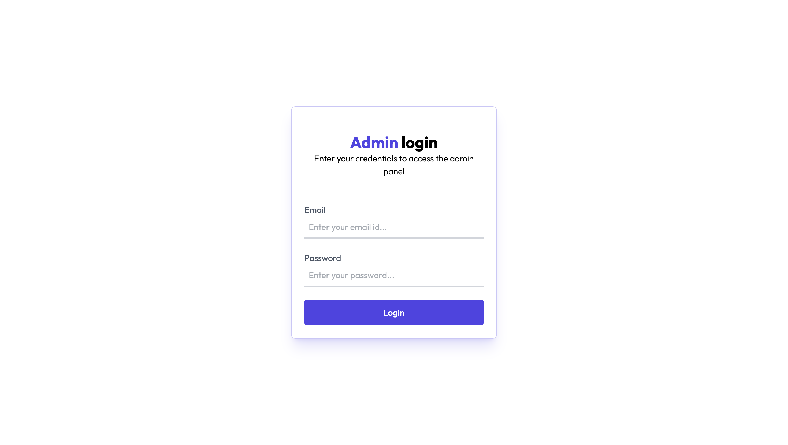
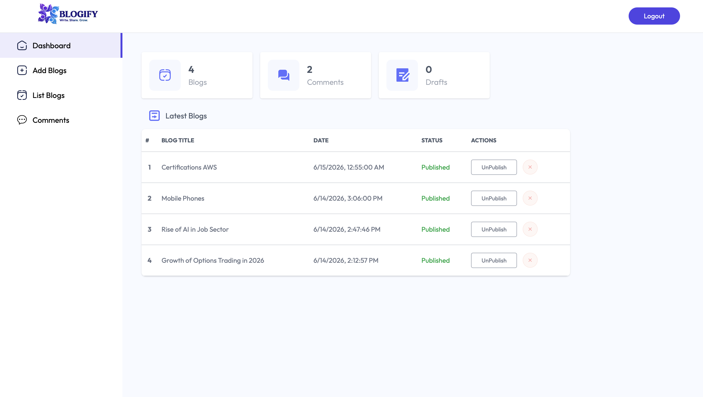
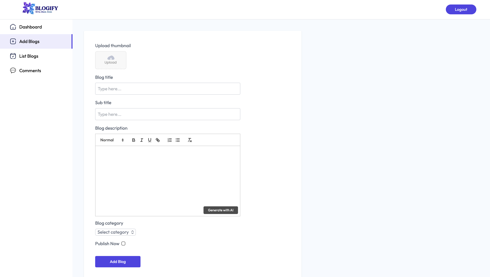
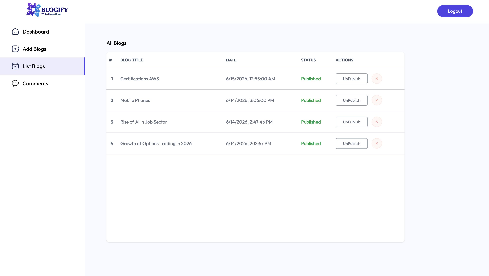
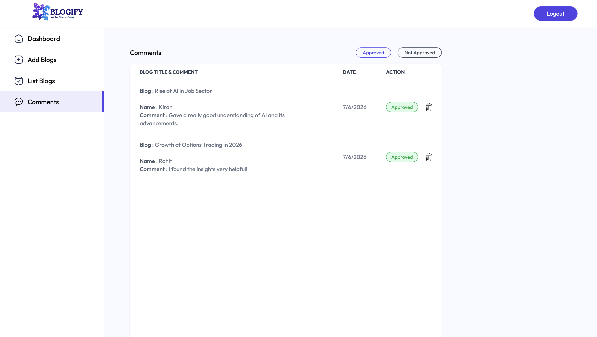
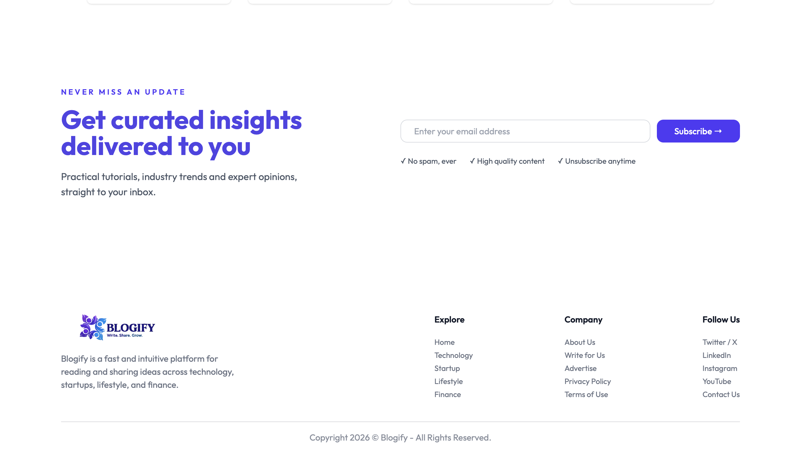

# 🚀 Blogify

A full-stack MERN blogging platform with JWT authentication, rich text editing, AI-powered content generation using Gemini API, image processing with ImageKit API, newsletter subscriptions, automated welcome emails, and an admin dashboard.

---

## 🌐 Live Demo

🔗 **Frontend:** https://blogifyy-swart.vercel.app/

🔗 **Backend API:** https://blogifyy-rreh.onrender.com

---

## 📸 Screenshots

### 🏠 Home Page


### 📖 Blog Details


### 🔐 Admin Login



### 📊 Admin Dashboard



### ✍️ Add Blog



### 📋 Blog Management



### 💬 Comment Management



### 📧 Newsletter



---

# ✨ Features

### 👤 User Features

- Browse blogs across multiple categories
- Search blogs by title or category
- Read full blog articles
- View approved comments
- Responsive design for desktop, tablet, and mobile
- Subscribe to the Blogify newsletter
- Receive automated welcome emails after subscribing

---

### 🛠 Admin Features

- Secure JWT Authentication
- Rich Text Blog Editor (Quill)
- Create new blog posts
- Upload blog images
- Publish / Unpublish blogs
- Delete blogs
- Moderate user comments
- Approve or reject comments
- Manage newsletter subscribers

---

# 🛠 Tech Stack

## Frontend

- React
- React Router DOM
- Tailwind CSS
- Axios
- React Hot Toast
- Quill Rich Text Editor

## Backend

- Node.js
- Express.js
- MongoDB
- Mongoose
- JWT Authentication
- Multer
- Nodemailer

## Deployment

- Frontend – Vercel
- Backend – Render
- Database – MongoDB Atlas

---

# 📂 Folder Structure

```text
Blogify
│
├── client
│   ├── src
│   ├── public
│   └── package.json
│
├── server
│   ├── config
│   ├── controllers
│   ├── middleware
│   ├── models
│   ├── routes
│   ├── utils
│   ├── server.js
│   └── package.json
│
├── screenshots
│
└── README.md
```

---

# ⚙️ Installation

## Clone Repository

```bash
git clone https://github.com/Nishant1016/Blogifyy.git
```

```bash
cd blogify
```

---

## Install Dependencies

### Frontend

```bash
cd client
npm install
```

### Backend

```bash
cd server
npm install
```

---

# 🔑 Environment Variables

Create a `.env` file inside the **server** directory.

```env
MONGODB_URI=

JWT_SECRET=

CLOUDINARY_CLOUD_NAME=
CLOUDINARY_API_KEY=
CLOUDINARY_API_SECRET=

EMAIL_USER=
EMAIL_PASS=
```

Create another `.env` file inside the **client** directory.

```env
VITE_BASE_URL=http://localhost:3000
```

---

# ▶️ Running the Application

### Backend

```bash
cd server
npm run server
```

### Frontend

```bash
cd client
npm run dev
```

---

# 📧 Newsletter System

Blogify includes a fully functional newsletter system.

### Features

- Email validation
- Duplicate subscription prevention
- MongoDB subscriber storage
- Automated welcome emails using Nodemailer

---

# 🔒 Authentication

- JWT Authentication
- Protected Admin Routes
- Persistent Login using Local Storage

---


